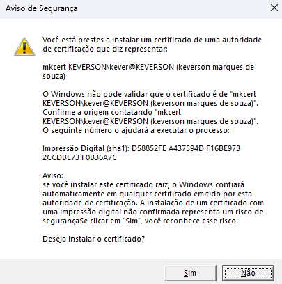
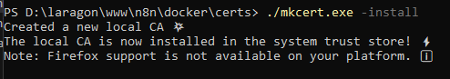
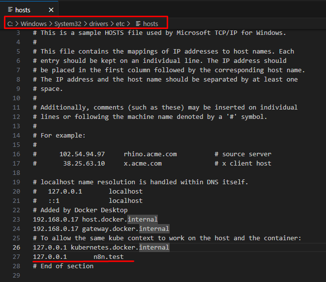

# Emissão certificado SSL auto assinado:

<details>
<summary><strong> 🪟 Windows </strong></summary>
Para geração de certificado SSL autoassinado no windows com mkcert, baixe o executável:

```bash
    https://github.com/FiloSottile/mkcert/releases
```

Baixe conforme arquitetura de seu sistema, no meu caso seria: `mkcert-v1.4.4-windows-amd64.exe`

após, acesse o local onde foi feito o download do executável, via algum terminal de comando e execute:

> [!IMPORTANT]
> Verifique se o arquivo possui exatamente o mesmo nome da instrução abaixo. Se não tiver, `renomeie` o arquivo que fez download ou `altere` o comando para que o arquivo baixado tenha exatamente o mesmo nome.

```bash
    .\mkcert.exe -install
```

O resultado da execução do comando acima, dever ser algo similar:
<div style="text-align:center"></div>

> [!warning]
> Você deve clicar na opção Sim para a instalação do `rootCA` do `mkcert` no `Windows`, do contrário, o próximo comando não funcionará.


E no terminal, onde executou o comando `.\mkcert.exe -install` terá uma saída similar:

<div style="text-align:center"></div>

Na sequência, execute no mesmo nível de diretório de antes o seguinte comando:

```bash
    .\mkcert.exe n8n.test
```

O domínio acima, foi configurado no host do `Windows`, em:

```
    c:\windows\system32\drivers\etc
```

Execute o arquivo `hosts` como `administrador` para poder customizar um domínio local em sua máquina:

<div style="text-align:center"></div>

A visão do arquivo deve ser algo similar a imagem acima, o ip `172.28.64.1` é o IP raiz do docker, no ambiente em que este material está sendo feito, mas tanto faz você referenciar o equivalente ao seu ou `127.0.0.1`.

> [!tip]
> Como editar o arquivo `hosts` no [windows](https://king.host/wiki/artigo/como-editar-o-arquivo-hosts-no-windows/)?

</details>

<details>
<summary><strong> 🐧 Linux </strong></summary>
</details>
